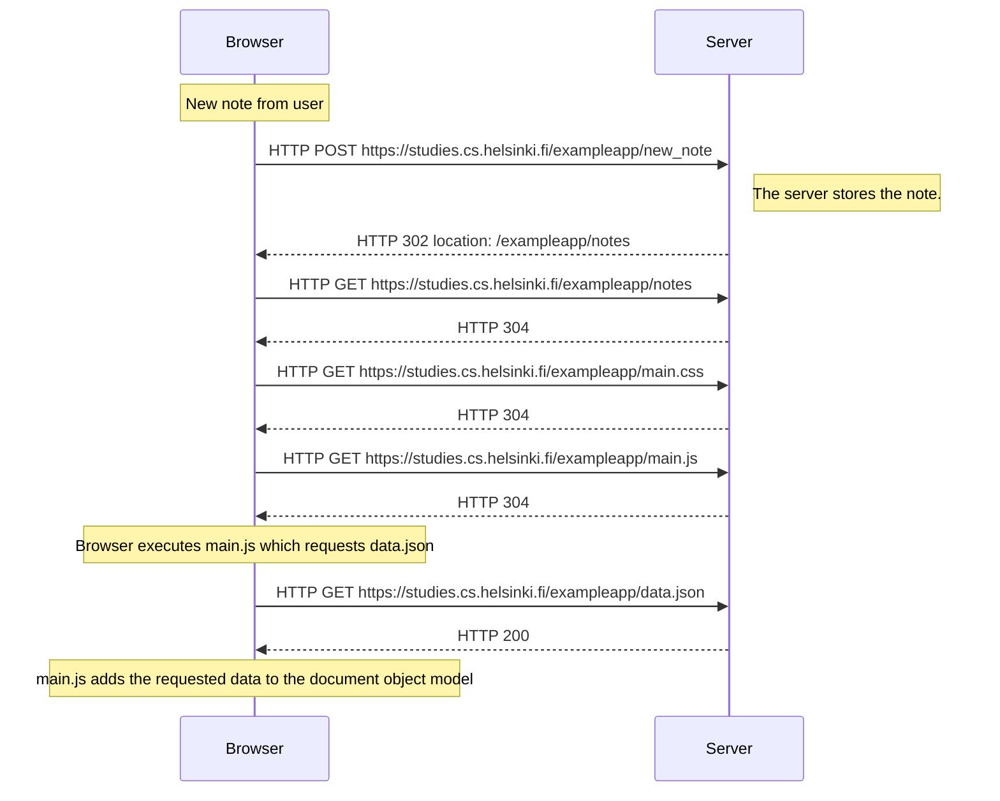

```mermaid
sequenceDiagram
    participant browser as Browser
    participant server as Server

    Note over browser: New note from user
    browser->>server: HTTP POST https://studies.cs.helsinki.fi/exampleapp/new_note
    Note right of server: The server stores the note.
    server-->>browser: HTTP 302 location: /exampleapp/notes
    browser->>server: HTTP GET https://studies.cs.helsinki.fi/exampleapp/notes
    server-->>browser: HTTP 304
    browser->>server: HTTP GET https://studies.cs.helsinki.fi/exampleapp/main.css
    server-->>browser: HTTP 304
    browser->>server: HTTP GET https://studies.cs.helsinki.fi/exampleapp/main.js
    server-->>browser: HTTP 304
    Note over browser: Browser executes main.js which requests data.json
    browser->>server: HTTP GET https://studies.cs.helsinki.fi/exampleapp/data.json
    server-->>browser: HTTP 200
    Note over browser: main.js adds the requested data to the document object model
```
