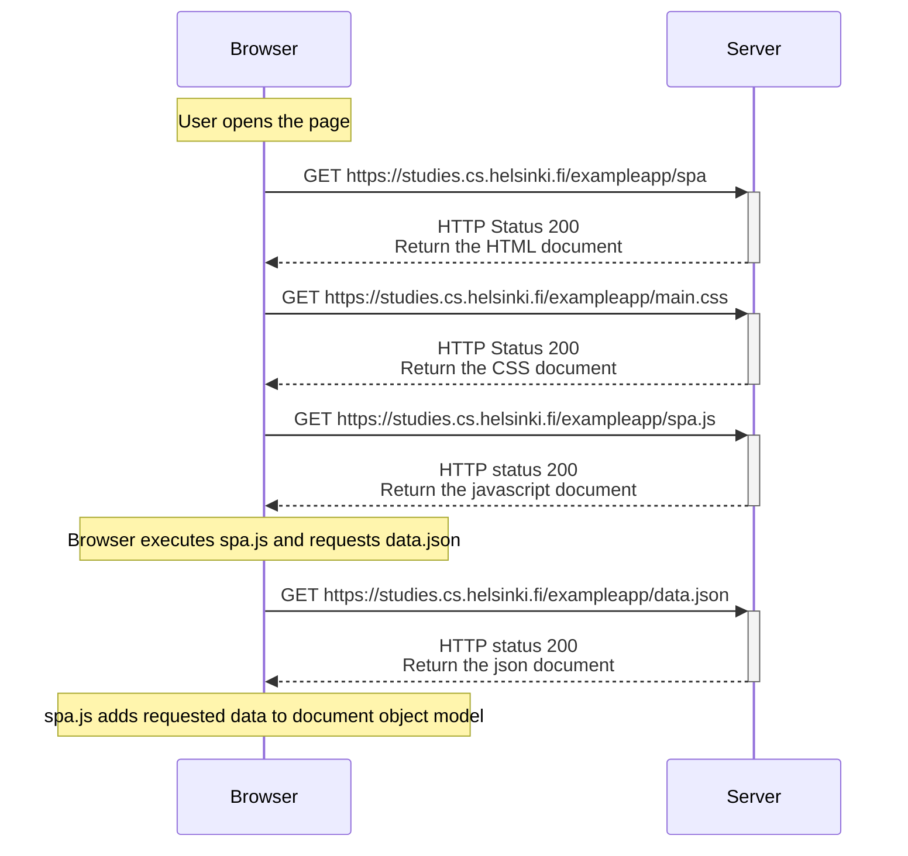

```mermaid
sequenceDiagram
	participant browser as Browser
	participant server as Server

	note over browser: User opens the page
	browser ->>+server:GET https://studies.cs.helsinki.fi/exampleapp/spa
	server -->>-browser: HTTP Status 200<br/> Return the HTML document
	
	browser ->>+server: GET https://studies.cs.helsinki.fi/exampleapp/main.css
	server -->>-browser: HTTP Status 200<br/> Return the CSS document
	
	browser ->>+server: GET https://studies.cs.helsinki.fi/exampleapp/spa.js
	server -->>-browser: HTTP status 200<br/>Return the javascript document
	
	note over browser: Browser executes spa.js and requests data.json
	
	browser ->>+server: GET https://studies.cs.helsinki.fi/exampleapp/data.json
	server -->>-browser: HTTP status 200<br/>Return the json document
	
	note over browser: spa.js adds requested data to document object model
```
