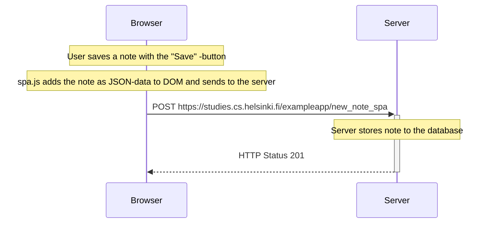

```mermaid
sequenceDiagram
	participant browser as Browser
	participant server as Server

	note over browser: User saves a note with the "Save" -button
	note over browser: spa.js adds the note as JSON-data to DOM and sends to the server
	browser ->>+server:POST https://studies.cs.helsinki.fi/exampleapp/new_note_spa
	note over server: Server stores note to the database
	server -->>-browser: HTTP Status 201<br/>
```
